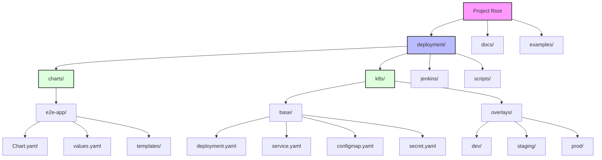
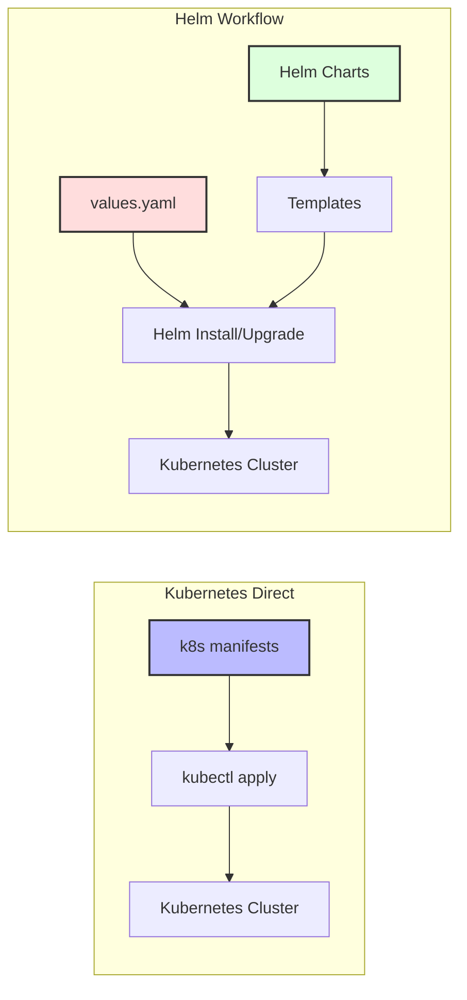
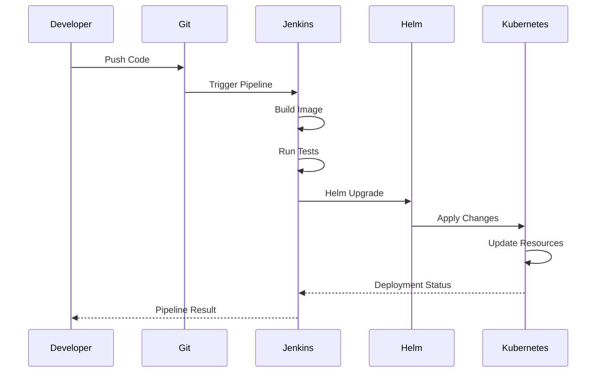
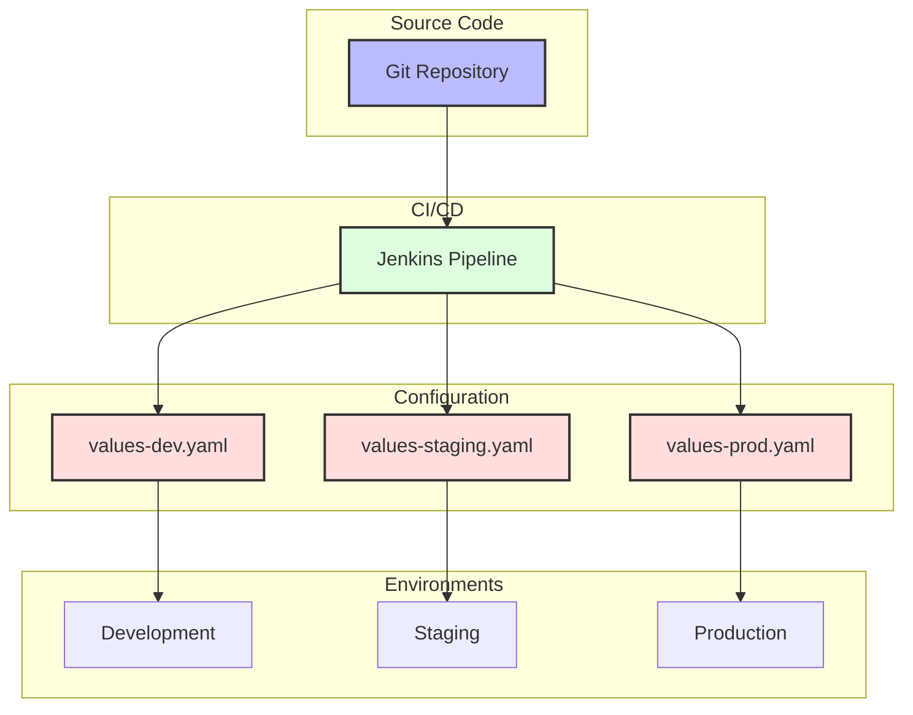
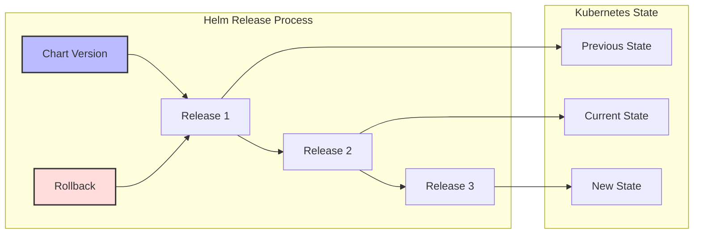

# Infrastructure Architecture Diagrams

## Project Structure

```mermaid
graph TD
    A[Project Root] --> B[deployment/]
    A --> C[docs/]
    A --> D[examples/]
    
    B --> E[charts/]
    B --> F[k8s/]
    B --> G[jenkins/]
    B --> H[scripts/]
    
    E --> I[e2e-app/]
    I --> J[Chart.yaml]
    I --> K[values.yaml]
    I --> L[templates/]
    
    F --> M[base/]
    F --> N[overlays/]
    
    M --> O[deployment.yaml]
    M --> P[service.yaml]
    M --> Q[configmap.yaml]
    M --> R[secret.yaml]
    
    N --> S[dev/]
    N --> T[staging/]
    N --> U[prod/]

    style A fill:#f9f,stroke:#333,stroke-width:2px
    style B fill:#bbf,stroke:#333,stroke-width:2px
    style E fill:#dfd,stroke:#333,stroke-width:2px
    style F fill:#dfd,stroke:#333,stroke-width:2px
```

## Kubernetes vs Helm Workflow

```mermaid
graph LR
    subgraph "Kubernetes Direct"
        A[k8s manifests] --> B[kubectl apply]
        B --> C[Kubernetes Cluster]
    end
    
    subgraph "Helm Workflow"
        D[Helm Charts] --> E[Templates]
        F[values.yaml] --> G[Helm Install/Upgrade]
        E --> G
        G --> H[Kubernetes Cluster]
    end

    style A fill:#bbf,stroke:#333,stroke-width:2px
    style D fill:#dfd,stroke:#333,stroke-width:2px
    style F fill:#fdd,stroke:#333,stroke-width:2px
```

## Deployment Process

```mermaid
sequenceDiagram
    participant D as Developer
    participant G as Git
    participant J as Jenkins
    participant H as Helm
    participant K as Kubernetes

    D->>G: Push Code
    G->>J: Trigger Pipeline
    J->>J: Build Image
    J->>J: Run Tests
    J->>H: Helm Upgrade
    H->>K: Apply Changes
    K->>K: Update Resources
    K-->>J: Deployment Status
    J-->>D: Pipeline Result
```

## Environment Management

```mermaid
graph TD
    subgraph "Source Code"
        A[Git Repository]
    end
    
    subgraph "CI/CD"
        B[Jenkins Pipeline]
    end
    
    subgraph "Configuration"
        C[values-dev.yaml]
        D[values-staging.yaml]
        E[values-prod.yaml]
    end
    
    subgraph "Environments"
        F[Development]
        G[Staging]
        H[Production]
    end
    
    A --> B
    B --> C & D & E
    C --> F
    D --> G
    E --> H

    style A fill:#bbf,stroke:#333,stroke-width:2px
    style B fill:#dfd,stroke:#333,stroke-width:2px
    style C fill:#fdd,stroke:#333,stroke-width:2px
    style D fill:#fdd,stroke:#333,stroke-width:2px
    style E fill:#fdd,stroke:#333,stroke-width:2px
```

## Release Management

```mermaid
graph LR
    subgraph "Helm Release Process"
        A[Chart Version] --> B[Release 1]
        B --> C[Release 2]
        C --> D[Release 3]
        
        E[Rollback] --> B
    end
    
    subgraph "Kubernetes State"
        F[Previous State]
        G[Current State]
        H[New State]
    end
    
    B --> F
    C --> G
    D --> H
    
    style A fill:#bbf,stroke:#333,stroke-width:2px
    style E fill:#fdd,stroke:#333,stroke-width:2px
```