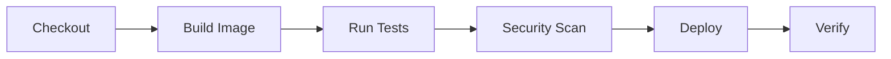

# Jenkins CI/CD Configuration Guide

## Overview

Our Jenkins setup provides a complete CI/CD pipeline running on Kubernetes, using containerized builds and automated deployments.

## Pipeline Structure



## Configuration Components

### 1. Jenkinsfile

The pipeline is defined in `deployment/jenkins/Jenkinsfile` and includes:

```groovy
pipeline {
    agent {
        kubernetes {
            // Dynamic agent configuration
        }
    }
    stages {
        // Pipeline stages
    }
}
```

#### Key Stages:

1. **Checkout**
   - Fetches source code
   - Prepares workspace

2. **Build Docker Image**
   ```groovy
   stage('Build Docker Image') {
       steps {
           container('docker') {
               // Builds and pushes Docker image
           }
       }
   }
   ```

3. **Run Tests**
   - Executes test suites
   - Reports test results

4. **Security Scan**
   - Vulnerability scanning
   - Code quality checks

5. **Deploy to Kubernetes**
   ```groovy
   stage('Deploy to Kubernetes') {
       steps {
           container('helm') {
               // Helm deployment
           }
       }
   }
   ```

6. **Verify Deployment**
   - Checks deployment status
   - Validates application health

### 2. Jenkins Configuration (config.yaml)

Located in `deployment/jenkins/config.yaml`:

```yaml
jenkins:
  clouds:
    kubernetes:
      # Kubernetes integration settings
  securityRealm:
    # Security configuration
  authorizationStrategy:
    # Access control settings
  pipeline:
    # Pipeline configurations
  tools:
    # Tool installations
  credentials:
    # Credential definitions
```

## Environment Variables

```bash
# Required Environment Variables
DOCKER_REGISTRY=your-registry
APP_NAME=e2e-app
NAMESPACE=${BRANCH_NAME == 'main' ? 'production' : 'development'}
```

## Security Configuration

1. **Role-Based Access Control**
   ```yaml
   authorizationStrategy:
     roleBased:
       roles:
         global:
           - name: "admin"
             permissions:
               - "Overall/Administer"
           - name: "developer"
             permissions:
               - "Overall/Read"
               - "Job/Build"
   ```

2. **Credentials Management**
   - Docker Registry credentials
   - GitHub credentials
   - Kubernetes configuration

## Kubernetes Integration

### Pod Template
```yaml
apiVersion: v1
kind: Pod
spec:
  containers:
  - name: docker
    image: docker:dind
  - name: kubectl
    image: bitnami/kubectl:latest
  - name: helm
    image: alpine/helm:latest
```

### Container Agents
1. **Docker-in-Docker**
   - Building container images
   - Running containerized tests

2. **Kubectl**
   - Kubernetes deployments
   - Resource management

3. **Helm**
   - Chart deployment
   - Release management

## Deployment Process

### 1. Development Flow
```bash
Branch: feature/*
→ Development namespace
→ Development values
→ Feature testing
```

### 2. Production Flow
```bash
Branch: main
→ Production namespace
→ Production values
→ Live deployment
```

## Best Practices

1. **Security**
   - No hardcoded credentials
   - Secure agent configuration
   - RBAC implementation

2. **Pipeline**
   - Containerized builds
   - Isolated environments
   - Proper error handling

3. **Deployment**
   - Environment separation
   - Rollback capability
   - Health verification

## Monitoring and Logging

1. **Build Logs**
   - Console output
   - Test results
   - Deployment status

2. **Metrics**
   - Build duration
   - Success/failure rates
   - Resource usage

## Troubleshooting

### Common Issues

1. **Docker Build Failures**
   ```bash
   # Check Docker daemon
   docker info
   # Check registry access
   docker login $DOCKER_REGISTRY
   ```

2. **Deployment Issues**
   ```bash
   # Check Kubernetes connectivity
   kubectl get nodes
   # Check pod status
   kubectl get pods -n $NAMESPACE
   ```

3. **Pipeline Errors**
   - Check Jenkins agent logs
   - Verify credentials
   - Check resource limits

## Maintenance

### Regular Tasks

1. **Updates**
   - Jenkins version
   - Plugin updates
   - Agent images

2. **Cleanup**
   - Workspace cleanup
   - Docker image pruning
   - Build history

3. **Backup**
   - Configuration backup
   - Credential backup
   - Pipeline scripts

## Quick Reference

### Useful Commands

```bash
# View build logs
jenkins-cli console-log JOB_NAME BUILD_NUMBER

# Restart pipeline
jenkins-cli restart-pipeline JOB_NAME

# Check agent status
jenkins-cli list-agents
```

### Important URLs

```
Jenkins UI: http://jenkins:8080
Build Status: http://jenkins:8080/job/[JOB_NAME]/
Blue Ocean: http://jenkins:8080/blue/
```

## Additional Resources

1. [Jenkins Documentation](https://www.jenkins.io/doc/)
2. [Kubernetes Plugin](https://plugins.jenkins.io/kubernetes/)
3. [Pipeline Syntax](https://www.jenkins.io/doc/book/pipeline/syntax/)